# 🗺️ BelajarKUY — Master Roadmap

> Timeline dan milestone utama pengembangan project BelajarKUY.
> **Format:** Relative day (D1, D2, ...) — bukan tanggal absolut, agar tetap valid jika jadwal bergeser.

---

## Phase Overview

```mermaid
gantt
    title BelajarKUY Development Timeline (Relative Days)
    dateFormat  X
    axisFormat  Day %s
    section Phase 1: Foundation
        Project Setup & Database      :p1, 0, 3
        Auth System (Breeze + Role)   :p2, after p1, 3
    section Phase 2: Core Features
        Landing Page & Frontend Base  :p3, after p1, 5
        Category CRUD                 :p4, after p2, 2
        Course CRUD (Instructor)      :p5, after p2, 5
        Section & Lecture             :p6, after p5, 3
    section Phase 3: Commerce
        Cart & Wishlist               :p7, after p3, 3
        Payment Midtrans              :p8, after p7, 5
        Coupon System                 :p9, after p8, 2
    section Phase 4: Panels & Player
        Student Dashboard             :p10, after p3, 3
        Course Player (Watch Page)    :p10b, after p8, 3
        Admin Panel                   :p11, after p4, 7
        Instructor Panel              :p12, after p6, 3
    section Phase 5: Polish
        Review & Rating               :p13, after p10, 3
        Site Settings                 :p14, after p11, 2
        Testing & Bug Fix             :p15, after p14, 5
        Final Polish & Deploy         :p16, after p15, 3
```

---

## Detailed Milestones

### 🔵 Phase 1: Foundation (Day 1-6)

| # | Task | PIC | Est. Days | Deliverable |
|---|------|-----|-----------|-------------|
| 1.1 | Init Laravel 12 project | Yosua | 0.5 | Clean Laravel project |
| 1.2 | Setup TailwindCSS + Vite | Yosua | 0.5 | Working build pipeline |
| 1.3 | Create all migrations (19) | Yosua | 1 | All tables created |
| 1.4 | Create all Eloquent models (19) | Yosua | 1 | Models with relationships |
| 1.5 | Create seeders + factories | Yosua | 0.5 | Seeded database |
| 1.6 | Install Breeze + Auth scaffolding | Albariqi | 0.5 | Login/register works |
| 1.7 | Implement RoleMiddleware | Albariqi | 0.5 | Role-based access control |
| 1.8 | Setup Google OAuth (Socialite) | Albariqi | 1 | Google login works |
| 1.9 | Separate login pages per role | Albariqi | 1 | Admin/instructor/user login |

### 🟢 Phase 2: Core Features (Day 4-14)

| # | Task | PIC | Est. Days |
|---|------|-----|-----------|
| 2.1 | Landing page layout (app.blade.php) | Vascha & Quinsha | 1 |
| 2.2 | Navbar & Footer components | Vascha & Quinsha | 1 |
| 2.3 | Hero slider section | Vascha & Quinsha | 0.5 |
| 2.4 | Category section + card component | Vascha & Quinsha | 1 |
| 2.5 | Course card component | Vascha & Quinsha | 0.5 |
| 2.6 | Featured & bestseller courses | Vascha & Quinsha | 1 |
| 2.7 | Course detail page | Vascha & Quinsha | 2 |
| 2.8 | Category CRUD (admin) | Quinsha & Vascha | 1 |
| 2.9 | SubCategory CRUD (admin) | Quinsha & Vascha | 1 |
| 2.10 | Course CRUD (instructor) | Albariqi | 3 |
| 2.11 | Section & Lecture CRUD | Albariqi | 2 |
| 2.12 | Course Goals CRUD | Albariqi | 0.5 |

### 🟡 Phase 3: Commerce (Day 10-20)

| # | Task | PIC | Est. Days |
|---|------|-----|-----------|
| 3.1 | Wishlist add/remove (AJAX) | Ray | 1 |
| 3.2 | Cart system (add/remove/fetch) | Ray | 2 |
| 3.3 | Cart page UI | Ray | 1 |
| 3.4 | Checkout page | Ray | 1 |
| 3.5 | Midtrans integration | Ray | 3 |
| 3.6 | Payment callback handler | Ray | 1 |
| 3.7 | Order creation after payment | Ray | 1 |
| 3.8 | Coupon apply system | Ray | 1 |

### 🟠 Phase 4: Panels & Course Player (Day 12-24)

| # | Task | PIC | Est. Days |
|---|------|-----|-----------|
| 4.1 | Student dashboard | Vascha & Quinsha | 1 |
| 4.2 | Student enrolled courses | Vascha & Quinsha | 1 |
| 4.3 | Student profile & settings | Vascha & Quinsha | 1 |
| 4.4 | **Course Player (watch page)** | Albariqi + Vascha | 3 |
| 4.5 | Admin dashboard (stats) | Quinsha & Vascha | 1 |
| 4.6 | Admin course management | Quinsha & Vascha | 1 |
| 4.7 | Admin instructor management (view only) | Quinsha & Vascha | 0.5 |
| 4.8 | Admin order management | Quinsha & Vascha | 1 |
| 4.9 | Admin user management | Quinsha & Vascha | 1 |
| 4.10 | Admin slider/info/partner CRUD | Quinsha & Vascha | 1 |
| 4.11 | Instructor dashboard | Albariqi | 1 |
| 4.12 | Instructor profile & settings | Albariqi | 0.5 |

### 🔴 Phase 5: Polish (Day 22-30)

| # | Task | PIC | Est. Days |
|---|------|-----|-----------|
| 5.1 | Review & rating system | Quinsha & Vascha | 2 |
| 5.2 | Site settings CRUD | Quinsha & Vascha | 1 |
| 5.3 | SMTP/Midtrans/Google settings | Quinsha & Vascha | 1 |
| 5.4 | Responsive design check | Vascha & Quinsha | 1 |
| 5.5 | Bug fixing | ALL | 3 |
| 5.6 | Performance optimization | Yosua | 1 |
| 5.7 | Final testing | ALL | 2 |
| 5.8 | Documentation & README | Yosua | 1 |

---

## Checkpoints

| Week | Target | % Complete |
|------|--------|-----------|
| Week 1 | Foundation + Auth + DB | 25% |
| Week 2 | Frontend + Course CRUD | 50% |
| Week 3 | Commerce (Cart, Payment) + Panels | 75% |
| Week 4 | Polish, Testing, Deploy | 100% |

---

*Timeline ini adalah estimasi. Update `PROGRESS_TRACKER.md` untuk tracking aktual.*
